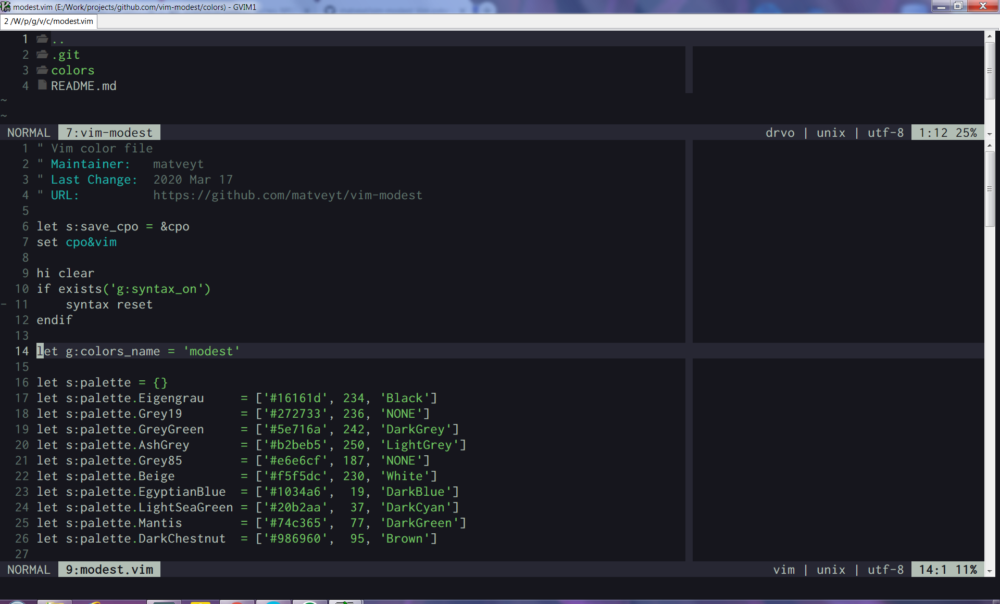
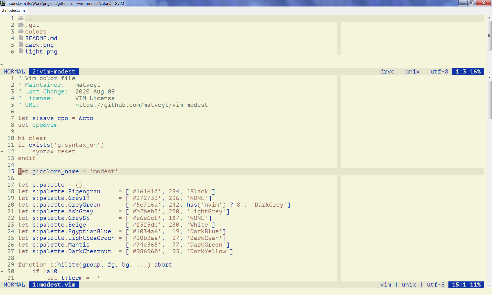

### Vim modest colorscheme

A Vim color scheme designed to look nice in all terminals.

### Installation

Use any plugin manager or simply copy _modest.vim_ into your _colors/_ subdirectory.

### Screenshots

