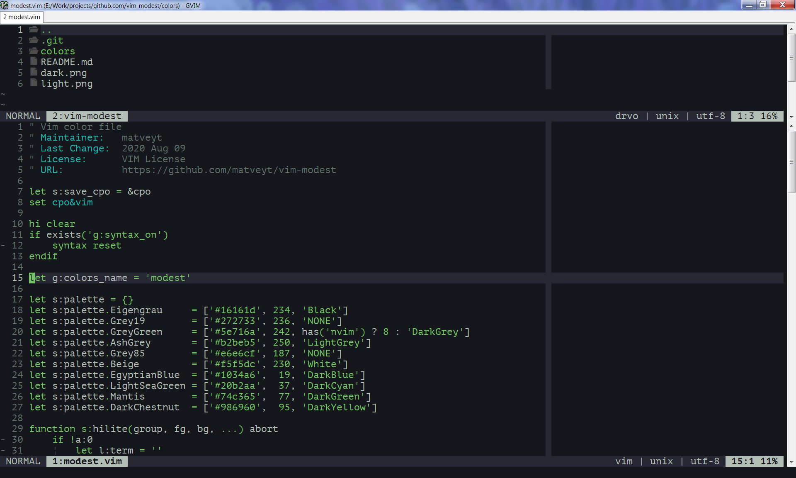

### Vim modest colorscheme

A Vim color scheme looking good in all terminals.

Support for 8/16/256/TrueColor on both dark and light backgrounds. No setup required.

### Installation

Using [minpac](https://github.com/k-takata/minpac):

```vim
call minpac#init()
call minpac#add('matveyt/vim-modest', {'type': 'opt'})
```

Or use any other plugin manager or simply copy _modest.vim_ to your _colors/_
subdirectory.

Note: prefer installing your colorschemes under `opt` to keep `&runtimepath` as short as
possible.

### Troubleshooting

On some rare occasions your Vim/Neovim may fail to detect *&t_Co* properly. For example,
Neovim reports 256 colors running on */dev/tty* with 16 colors only. You can try the
following to fix this:

    " disable TrueColor
    set notermguicolors
    " disable xterm 256 colors
    let g:colors_8bit = 0
    " reload color scheme
    colorscheme modest

### Screenshots




